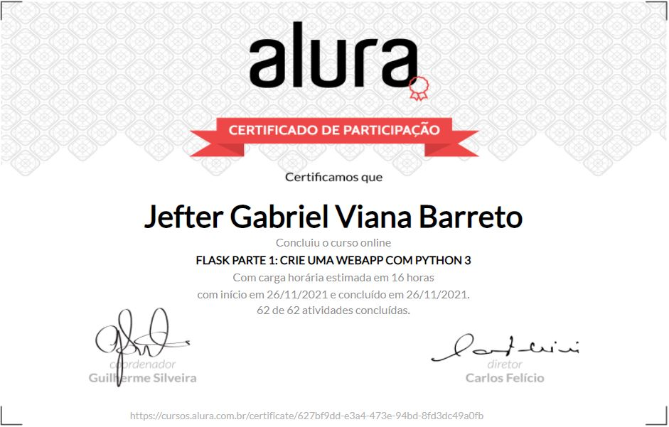

# Alura Flask Curso Parte 1
 
<h1 align="center" >
 
  
 
</h1>

<a href="https://cursos.alura.com.br/certificate/627bf9dd-e3a4-473e-94bd-8fd3dc49a0fb">
  

      
Check my credential!

  

</a>

Ola! Vou listar as habilidades trabalhadas e explicar o codigo.

## 🚀 Technologies

Este projeto foi desenvolvido com as seguintes tecnologias:

- ✔️ Python 
- ✔️ Flask

Habilidades desenvolvidas:

- ✔️ Aprenda a criar uma aplicação web com Flask
- ✔️ Faça um site elegante usando HTML e Bootstrap
- ✔️ Crie um sistema de login e autorização
- ✔️ Aprenda a definir rotas, redirecionamentos e templates
- ✔️ Crie URL dinâmicas

Descrição:

Durante esse curso, nós fizemos uma aplicação chamada jogoteca, que consiste em uma listagem de jogos. Nela, implementamos a possibilidade de adicionar novos jogos a essa lista, além de uma autenticação básica para o usuário. Com isso, percebemos que é bastante simples trabalhar com o Flask, até porque precisamos escrever bem pouco código.

 
 
